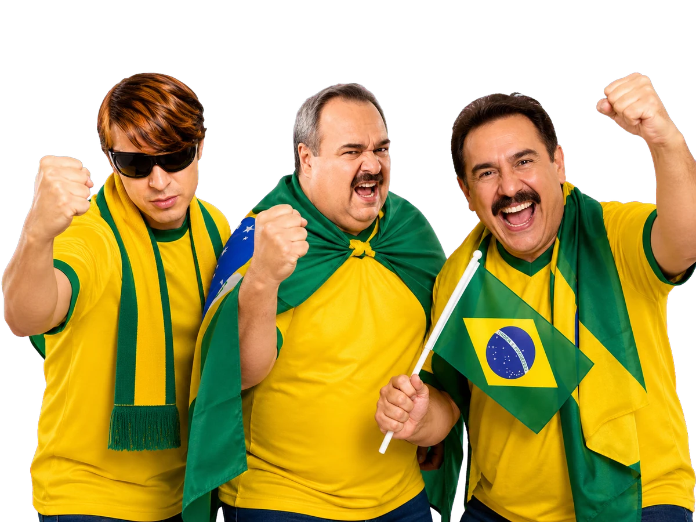

# Bolasso 2026

  

Bolão entre amigos para acompanhar a Copa do Mundo de 2026, registrar
palpites e disputar o topo do ranking.

**Acesse:** <https://evermatos.github.io/bolasso_2026/>

## Como funciona

1. Crie sua conta usando um username e uma senha.
2. Informe o placar que você espera para cada partida.
3. Altere o palpite quando quiser, até cinco minutos antes do jogo.
4. Acompanhe os resultados, sua pontuação e o ranking.
5. Clique em um participante no ranking para ver os palpites já liberados.

Os horários das partidas são exibidos no fuso de Abu Dhabi (`Asia/Dubai`).

## Pontuação

| Acerto | Pontos |
| --- | ---: |
| Placar exato | **7** |
| Resultado e gols exatos de uma seleção | **5** |
| Vencedor ou empate | **3** |
| Gols exatos de apenas uma seleção | **1** |
| Nenhuma condição | **0** |

Vale sempre a maior categoria atingida. Por exemplo: se o palpite for `2 × 0`
e o resultado terminar `2 × 1`, o participante recebe **5 pontos**.

## Palpites dos participantes

Os palpites de outras pessoas ficam visíveis somente depois que o prazo da
partida encerra. Assim, ninguém consegue copiar um palpite enquanto ele ainda
pode ser alterado.

## Perfil e administração

Cada participante pode escolher um avatar temático, alterar seu username e
sua senha na página de perfil. Trocar a imagem ou o username não altera
pontos, palpites ou permissões.

Somente administradores podem publicar resultados. Quando um resultado é
registrado ou corrigido, os pontos e o ranking são recalculados
automaticamente.

## Odds do Polvo

As odds ficam em `public.match_odds` e devem ser sincronizadas por script
administrativo, usando chaves secretas apenas no ambiente local/servidor.

1. Rode `supabase/migrations/20260623_match_odds.sql` no SQL Editor.
2. Adicione `SUPABASE_SERVICE_ROLE_KEY` e `THE_ODDS_API_KEY` no `.env.local`.
3. Confira os esportes disponíveis com `npm run odds:list-sports`.
4. Teste o casamento dos jogos com `npm run odds:sync:dry`.
5. Grave as odds no banco com `npm run odds:sync`.

O script usa `ODDS_SPORT_KEY=soccer_fifa_world_cup` por padrão. Se a API ainda
não disponibilizar odds da Copa, use `npm run odds:list-sports` para descobrir
qual chave está ativa.

## Sobre

O Bolasso 2026 foi criado para uma competição informal entre amigos. Não
possui vínculo oficial com a FIFA ou com as seleções participantes.
